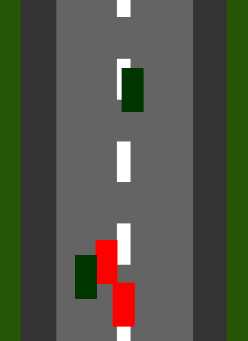

# Car Race (squelette)

Bases d’un jeu de course. L’objectif est de distancer un maximum de voitures dans le temps imparti. Diriger la voiture avec les flèches gauche/droite, pour éviter vos concurrent-e-s. Accélérer, à vos risques et périls (plus la voiture accélère, moins elle est facile à diriger) avec la flèche ’haut’ pour dépasser encore plus de concurrent-e-s.

Vous pouvez tester le jeu [ici](https://aucoindujeu.github.io/base-carrace).

À améliorer (graphismes, sons, etc.) ou à simplement  modifier sans vergogne. 

Pistes : 
- améliorer les graphismes en créant vos propres images de bolides, de bordures, de route…
- améliorer les sons
- améliorer les écrans titre, menu, game-over…
- modifier le système de collision pour rendre le jeu plus facile
- on constate que les voitures concurrentes peuvent se chevaucher, se rentrer dedans… c’est injuste ! étendre le système de collision aux autres voitures
- créer différents types de voitures avec des caractéristiques (vitesse max, maniabilité…) différentes
- créer une voiture avec une jauge de vie afin que le jeu ne s’arrête pas au premier impact
- créer un système de bonus à ramasser
- ajouter un mode deux joueurs en s’inspirant de ce qui a été fait sur [Asteroids Race](https://github.com/aucoindujeu/AsteroidsRace_squelette), et s’ignitier à la programmation orientée objet !

Créé pour servir de support lors des ateliers « Code Club » du Cimelab.

<!-- TODO -->

Pour lancer le jeu :

        make play

En faire une version exécutable sur le web (avec love.js) : 

        make js

